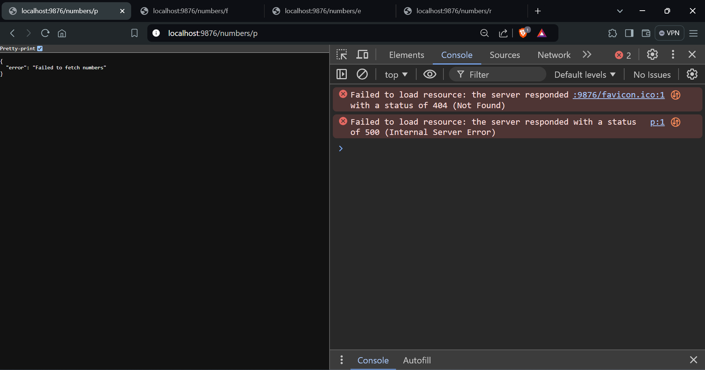

# Average Calculator Microservice

## Description

The Average Calculator Microservice is a Node.js application that provides a REST API to fetch numbers of different types (prime, Fibonacci, even, random) and calculates the average of a sliding window of these numbers. The service maintains a window of unique numbers with a fixed size and updates it with each request.

## Features

- **Fetch Numbers**: Retrieve numbers from a test server based on the specified qualifier (prime, Fibonacci, even, random).
- **Sliding Window**: Maintain a sliding window of unique numbers with a maximum size of 10.
- **Average Calculation**: Calculate and return the average of the numbers in the current window.
- **Error Handling**: Gracefully handle errors, including request timeouts and invalid qualifiers.
- **Quick Responses**: Ensure responses are generated within 500 milliseconds.

## Installation

1. **Clone the repository**:
   ```bash
   git clone https://github.com/your-username/your-repository.git

2. **Run the Server**:
   ```bash
   node average_calculator.js


## Postman Screenshots




